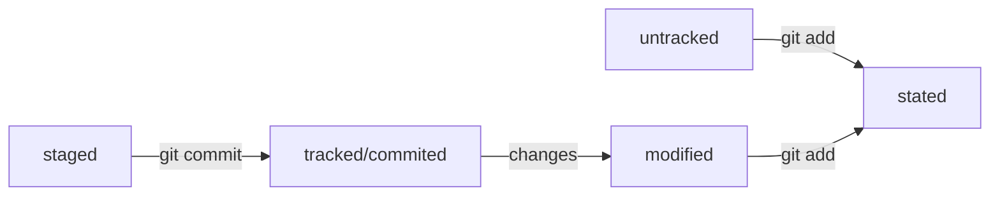

###Руководство Git.

Привет мой _дорогой друг_

В данном руководстве я постараюсь рассказать тебе

о основных возможностях Git.

## Начнем.

для начала тебе необходимо создать папку с проектом

для этого воспользуемя консолной командой 

```
mkdir %Название репозитория%
```

Дальше необходимо перейти в только что создыннй проект

Используем команду 

```
cd %Название репозитория%
```

Теперь, когда мы перешли в директорию нашего проекта 

инициализируем здесь git

```
git init
```

**Отлично**, мы создали локальный репозиторий git.

для начала, я думаю, этого хватит.

###Продолжим улучшать нашу шпаргалку.

##Первое о чем напишем это ХЕШ.
 Хеш это способ преобразовать данные и получить их *"отпечаток"*
 
 Хеш хранится в git в виде таблицы. Для каждого коммита хеш уникален.
 
##Следующее о чем напишем это log

команда для вызова лога 

``` 
git log
```

Пример лога

```
commit e83c5163316f89bfbde7d9ab23ca2e25604af290
Author: Linus Torvalds <torvalds@linux-foundation.org>
Date:   Thu Apr 7 15:13:13 2005 -0700

    Initial revision of "git", the information manager from hell
```

так же можно получить сокрашенныей лог. Он несет ту же информации что и полный,
 но он лучше для восприятия, так как содержит только короткий хеш и текст коммита
 
Вызвается командой

``` 
git log --oneline
```

##Про HEAD напишем коротко, он указывает на последний коммит в логе.

## Статусы файлов в git

Всего в git имеется четыре статуса.

1. ___untreecked___ - неотслеживаемый (файл только что создан и ни одной
 из его версий нет в репозитории)
2. ___trcked___ - отслеживаемый (после того как он хотя бы один раз попал в репозиторий)
3. ___staged___ - подготовленный (файлы которые подготовлены к коммиту. В них могут воходить как
 как новые файлы, так и модифицированные)
4. ___modified___ - файл версия которой уже находится в репозитории и его подготовленная
 версия отличается содержанием.

##Рассмотрим схему статусов файлов git



 
Существует возможность исправить неверно сделанный коммит.

Для этого используется команда 

```
git commit --amend
```

Есть возможность убрать подготовленный файл из состояния staged

для этого применяется команда 

```
git restore --staged <file>
```

Если необходимо откатиться до определенного коммита назад то можно применить команду

```
git reset --hard <commit hash>
```

Команда git restore <file> позволяет убрать изменения в файле даже если он не добавлен в steged и tracked

```
git restore <file>
```
